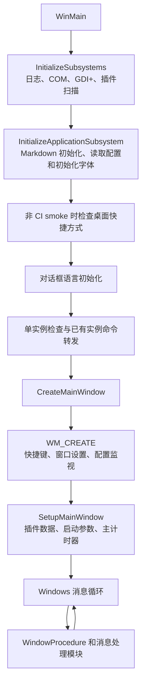

# 开发与构建

## 工程结构

| 路径 | 内容 |
| --- | --- |
| `src/main/` | WinMain、初始化、单实例和命令行转发 |
| `src/window/`、`src/window_procedure/` | 浮窗生命周期、交互和 Windows 消息处理 |
| `src/timer/`、`src/alarm/` | 计时、番茄钟阶段和闹钟 |
| `src/config/` | 配置加载、保存、迁移和热加载 |
| `src/tray/` | 托盘菜单、图标和动画 |
| `src/drawing/`、`src/markdown/`、`src/font/`、`src/color/` | 文本、图片、Markdown、字体和颜色渲染 |
| `src/plugin/` | 插件进程、输出文件和插件文本状态 |
| `src/dialog/`、`resource/` | 对话框实现、资源模板和运行时语言文件 |
| `include/` | 对应模块的公共声明 |

## 启动和消息流

以下是源码中的应用接线顺序；它不是 Windows 系统行为的验证记录。详细阶段入口和验证边界见[项目集成与验证边界](project-integration.md)。



`WindowProcedure` 将窗口事件分发到 `window_procedure/` 下的处理模块。多媒体定时器回调会向窗口线程投递消息；计时状态和主要 UI 更新由窗口线程处理。此描述来自代码路径，运行时定时精度未在本次文档复核中测量。

## 构建

### Linux 或 WSL + MinGW-w64

提供的 `build.sh` 使用 i686 MinGW 交叉编译器和 CMake：

```bash
sudo apt install cmake mingw-w64
./build.sh Debug
./build.sh Release
```

默认构建产物位于 `build/`。`build.sh` 还接受输出目录作为第二个参数。

### Windows + MinGW

```bat
build.bat Debug
build.bat Release
```

脚本会在仓库的 `build/` 目录中配置并构建。CMake 项目本身也包含 MSVC 编译选项；需要调整工具链时可直接使用 CMake 配置项目。

## CI 检查

GitHub Actions 工作流包含 MinGW 构建、CodeQL、Cppcheck、Gitleaks、Semgrep、MSVC 静态分析，以及 Windows AddressSanitizer smoke 运行。仓库当前没有单独的单元测试目录；CI smoke 会以 `--ci-smoke` 启动程序、按定时器退出并检查 ASan 日志，不能代替某项功能的独立验证夹具。

相关配置见 [`CMakeLists.txt`](../CMakeLists.txt)、[`build.sh`](../build.sh)、[`build.bat`](../build.bat) 和 [`.github/workflows/build.yml`](../.github/workflows/build.yml)。
