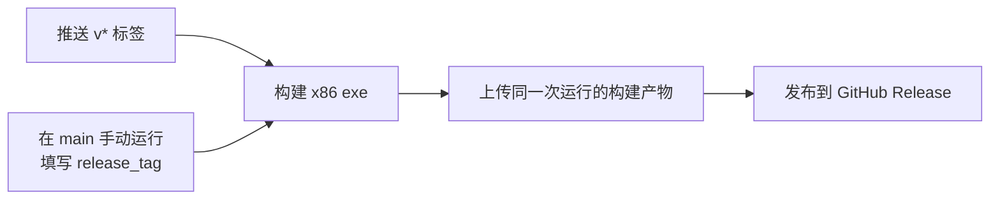

# GitHub Actions 发布工作流

本文说明 GitHub Actions 如何构建并发布 Windows x86 exe。版本号和完整发布操作见[Windows x86 稳定版发布](releasing.md)。

## 工作流分工

| 工作流 | 文件 | 用途 |
| --- | --- | --- |
| Catime CI | [`.github/workflows/build.yml`](../.github/workflows/build.yml) | PR、手动或每周定时运行代码检查和 CI 构建；普通 push 不触发，也不创建 Release。 |
| Release Catime | [`.github/workflows/release.yml`](../.github/workflows/release.yml) | 构建 x86 exe 并创建 GitHub Release。 |

Release Catime 不依赖 Catime CI 的构建产物，可以单独运行。发布的 exe 不做代码签名，也不会提交到 WinGet。

## Release Catime 的触发方式

### 推送新标签

推送 `v*` 标签会自动运行工作流；标签事件使用该标签所指提交中的工作流文件。标签应指向已经提交并推送到 `main` 的版本提交，而且该提交应包含要使用的 Release 工作流定义。不要移动或覆盖已发布的标签。[GitHub 事件与工作流](https://docs.github.com/en/actions/reference/workflows-and-actions/events-that-trigger-workflows)

### 手动运行已有标签

标签已经存在、首次标签事件没有启动工作流，或需要用 `main` 上更新后的工作流重跑时：

1. 打开 **Actions → Release Catime → Run workflow**。此按钮要求工作流文件已存在于仓库默认分支；本仓库默认分支为 `main`。
2. 分支选择 `main`，让运行使用 `main` 上最新的工作流定义。
3. `release_tag` 填已存在的完整标签，例如 `v2026.09.28`。
4. 启动后，工作流会用 `main` 上的工作流配置，并检出该标签对应的应用源码。

单纯推送 `main` 不会重新触发已有标签的 Release。**Re-run jobs** 会沿用原运行的 commit 和 ref；若需要应用 `main` 上的新工作流，启动新的手动运行。[GitHub 重跑工作流说明](https://docs.github.com/en/actions/how-tos/manage-workflow-runs/re-run-workflows-and-jobs)

## 构建和发布过程

1. 工作流确认标签符合 `v数字.数字.数字` 格式，并与 `resource/resource.h` 中的 `CATIME_VERSION` 完全一致；不一致时停止。
2. 在 GitHub 托管的 Ubuntu runner 上安装 MinGW 和 CMake，运行 `./build.sh Release`。构建脚本使用 `i686-w64-mingw32-gcc`，目标是 x86。
3. 将 exe 命名为 `catime_<版本>.exe`，上传为 `catime-release-<版本>` 构建产物。
4. Release job 下载同名产物，并通过 `GITHUB_TOKEN` 创建 GitHub Release。工作流声明了 `contents: write` 权限。

上传与下载步骤的构建产物名称必须保持一致；下载路径也必须与创建 Release 步骤的 `files` 路径一致。改动其中一处时要同步检查另一处。

## 仓库设置和凭据

- 仓库 Actions 必须处于启用状态。Fork 首次使用时需在 **Actions** 页面完成一次 Enable workflows；仓库 **Settings → Actions → General** 的允许策略是另一项设置。
- Release 使用 Actions 自动提供的 `GITHUB_TOKEN` 创建 Release。
- 当前发布不使用 `SIGNPATH_API_TOKEN` 或 `WINGET_TOKEN`，不需要为签名或 WinGet 配置 Secret。

## 常见情况

| 情况 | 处理方式 |
| --- | --- |
| 推送标签后没有运行记录 | 确认仓库 Actions 已启用、标签以 `v` 开头，并检查标签所指提交中是否有 `release.yml`。已有标签改用手动运行。 |
| 工作流在版本检查处失败 | 确认标签去掉 `v` 后与 `CATIME_VERSION` 一致，例如 `v2026.09.28` 对应 `2026.09.28`。 |
| 手动运行检出标签失败 | 检查 `release_tag` 是否拼写正确，以及远端是否存在该标签。 |
| 构建成功但 Release 未创建 | 检查 Release job 的构建产物名称、下载路径和 `files` 路径是否匹配，并确认工作流仍有 `contents: write` 权限。 |

## 发布完成的判据

- Release Catime 的 build 和 release 两个 job 成功。
- GitHub Release 使用目标标签，并包含 `catime_<版本>.exe`。
- exe 是 x86（PE32 / Intel i386）；文件未签名。
