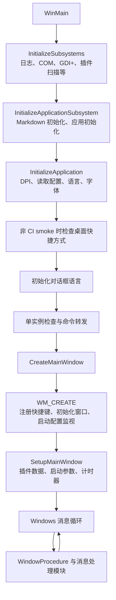

# 项目集成与验证边界

本页和 [`features/`](features/) 下的文档描述 Catime 如何把计时、闹钟、浮窗、托盘、插件和配置接入应用。它们记录当前仓库的状态、调用路径和配置关系，不作为独立的 Windows API 或桌面能力验证报告。

## 启动与事件入口

以下流程按当前源码整理。它说明应用内的调用顺序，不证明每个 Windows 系统调用在所有系统版本和桌面会话中都成功。

主要对应关系：

| 阶段 | 源码入口 | 职责 |
| --- | --- | --- |
| 进程初始化 | [`main_entry.c`](../src/main/main_entry.c)、[`main_initialization.c`](../src/main/main_initialization.c) | 初始化进程级组件，处理单实例，再创建和配置主窗口 |
| 配置和语言 | [`window_initialization.c`](../src/window/window_initialization.c)、[`config_core.c`](../src/config/config_core.c) | 读取配置、初始化默认语言和字体 |
| 窗口创建 | [`window_core.c`](../src/window/window_core.c)、[`window_message_handlers.c`](../src/window_procedure/window_message_handlers.c) | 创建主窗口；在 `WM_CREATE` 注册快捷键、初始化窗口并启动配置监视 |
| 计时和命令行 | [`main_initialization.c`](../src/main/main_initialization.c)、[`timer_events.c`](../src/timer/timer_events.c) | 初始化插件数据，解析本实例启动参数，启动主计时器和启动模式 |
| 消息分发 | [`window_procedure.c`](../src/window_procedure/window_procedure.c)、[`window_message_handlers.c`](../src/window_procedure/window_message_handlers.c) | 将 Windows 消息分发给窗口、托盘、快捷键、计时和配置处理模块 |

## 结论类型与验证要求

| 文档结论 | 可以支持的证据 | 不能据此推出 |
| --- | --- | --- |
| 应用内的状态转换、分支条件、调用方和配置读写 | 当前源码及其调用链 | Windows 桌面上实际显示效果、时序精度、系统策略或设备兼容性 |
| Win32、托盘、窗口、音频、睡眠恢复等系统集成 | 源码调用点可以说明应用尝试调用什么 | API 在目标环境成功、特定系统版本行为一致，或异常场景已覆盖 |
| CI 构建和 smoke | [`build.yml`](../.github/workflows/build.yml) 中的工作流步骤 | 某个单项功能已被独立复现或验证 |

本次复核只对照了源码和仓库工作流；没有在 Windows 桌面上构建或运行程序。因此文档中的运行时效果、系统通知表现、托盘重建、睡眠恢复及输入解析边界均未在本次复核中实测。CI 中的 Windows AddressSanitizer smoke 用于启动应用、按定时器退出并检查 ASan 日志，不是单项功能验证夹具。

## 独立技术能力记录

若文档要说明某项可复现的系统或运行时能力，应把它与 Catime 的业务接线说明分开，并在技术记录旁提供可运行的验证夹具。夹具应包含控制器和最小测试目标，能够由读者独立构建、运行并观察该能力；文档需写明操作系统版本和构建号、目标架构、桌面会话与权限条件、复现步骤、观察结果和已验证边界。系统接入模块的维护者应与技术记录一起维护验证夹具。

当前 `features/*.md` 没有这样的逐项验证夹具，因此其中关于 Windows 和桌面行为的内容只说明源码路径，不声称已完成环境验证。

## 已知的源码接线缺口

闹钟模块在 [`alarm_core.c`](../src/alarm/alarm_core.c) 实现了 `CheckMissedAlarms()`，但当前源码中没有找到调用点。窗口收到系统恢复消息时会在 [`window_procedure.c`](../src/window_procedure/window_procedure.c) 调用 [`Timer_OnSystemResume()`](../src/timer/timer.c) 并重建托盘动画；该路径没有调用补发闹钟函数。详见[闹钟与通知](features/alarms-and-notifications.md)。
